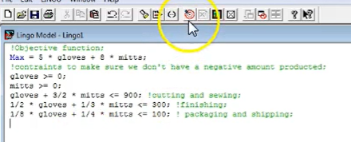
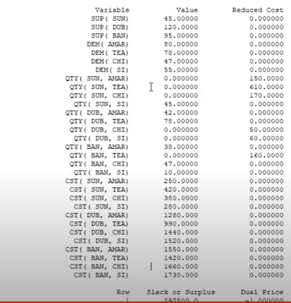

# MyLingo

My Lingo

## Simple example





## With stock





```lingo
SETS:      ! Defining the SETS;
PLANTS: SUP;    ! The Set PLANTS has an attribute of SUP (Supply);
WAREHOUSES: DEM;    ! The Set WAREHOUSES has an attribute of DEM (Demmand);
LINKS(PLANTS,WAREHOUSES): QTY, CST; ! QTY (Quantity) and CST (Cost) arrays have sizes = size(PLANTS)xsize(WAREHOUSES);
ENDSETS

DATA:      ! Defining the DATA;
PLANTS  = Sun Dub Ban;  ! Give PLANTS readable names;
WAREHOUSES = Amar Tea Chi Si; ! Give WAREHOUSES readable banes;
SUP  = 45 120 95;  ! Initialize the supply;
DEM  = 80 78 47 55;  ! Initialize the demand;
CST  = 250 420 380 280
    1280 990 1440 1520
     1550 1420 1660 1730; ! Initialize the Costs;


ENDDATA

!Objective function;
MIN = @SUM(LINKS(I,J):CST(I,J)*QTY(I,J)); ! Sum-product of the Cost and Quantity arrays

!Constraints;
@FOR(PLANTS(I):      ! For each ROW (Plants);
 @SUM(WAREHOUSES(J):QTY(I,J))<= SUP(I) ! Sum of COLOUMNS (Warehouses) should be <= SUPPLY;
     );

@FOR(WAREHOUSES(J):     ! For each COLOUMN (Warehouses);
 @SUM(PLANTS(I):QTY(I,J)) = DEM(J)  ! Sum of ROWS (PLANTS) should be = DEMAND;
     );
```

## More samples


